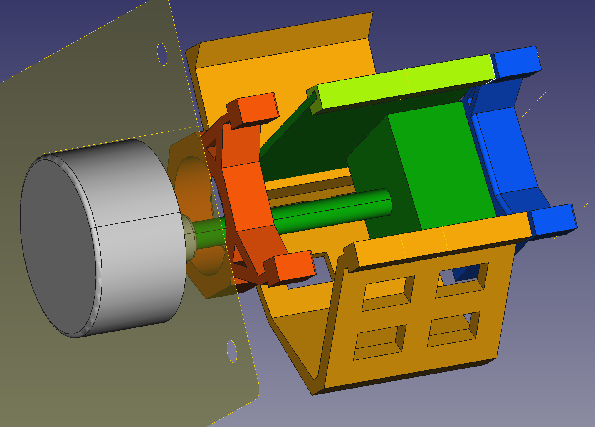
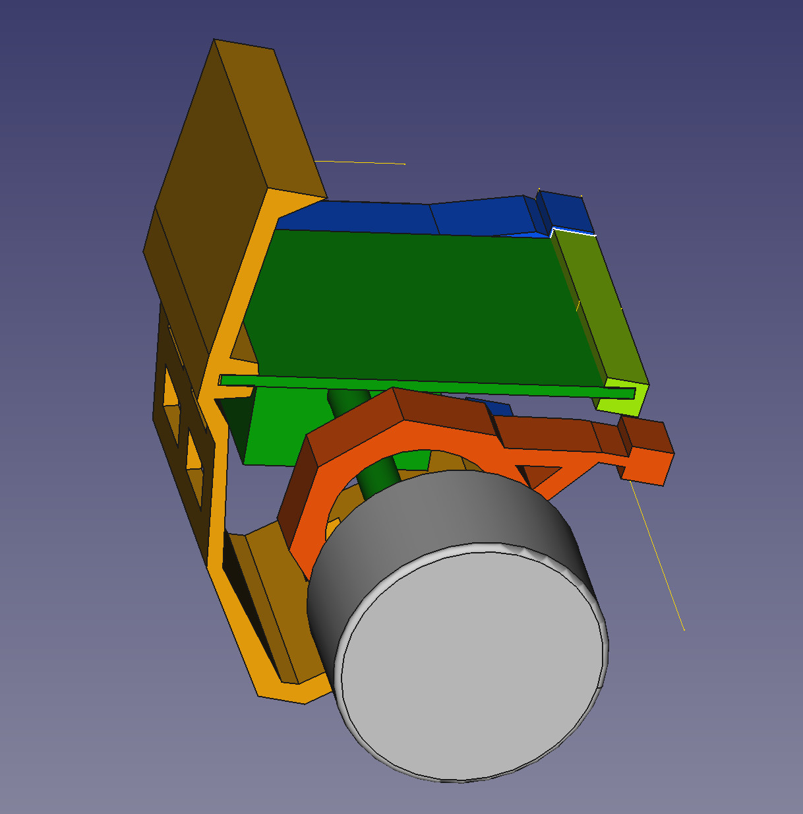

# Volume control assembly for Whammy headphone pamplifier
Or actually for any amplifier using the ALPS potentiomenter.

 

## Background
When desoldering the stereo potentiometer I partly damaged a few legs on the ALPS potentiometer.
I created a sub-PCB for the potentiometer, and added a basic left-right fine adjustment circuit.

This project is made for the Modushop Galaxy Maggiorato GX283 230 x 230 mm chassis with 10mm front.

The assembly is mounted in the slots of the chassis and it's set tight against the bottom and upper lid; it's a rock solid construction.

I've 3D-printed my copy on a Creality CR-6 SE #D printer, but this model should work on any 3D printer.

## Images
 
 
 